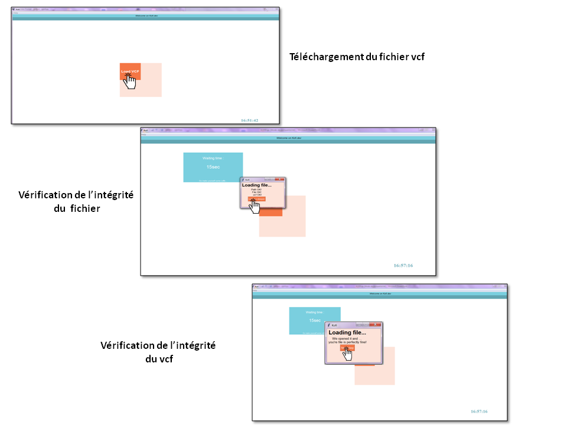
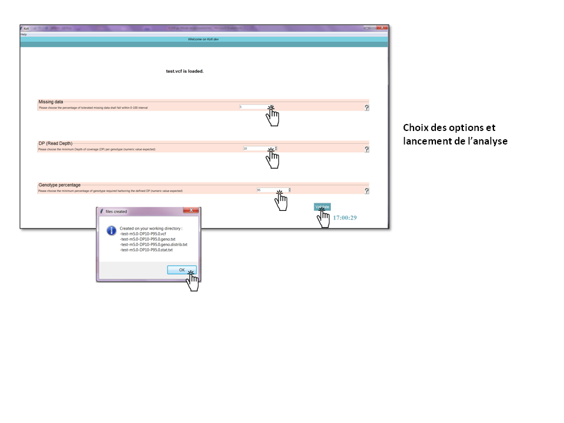
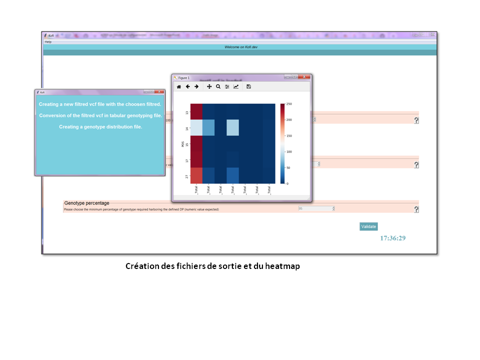

# Requis

## La version 3 et plus de Python est recommandée 
Librairies Python
> os
> sys
> re
> pathlib
> argparse
> re

Système d'exploitation 
> Linux / ubuntu 
> Windows (l'installation d'anaconda est recommandée) 

## Softwares/Modules
> python3-tk
> pandas 0.23.4
> numpy
> seaborn
> matplotlibe.pylot
> webbrowser
> math

Pour installer les modules nécessaires au bon fonctionnnement de KOFI:
```
pip install --upgrade *module name*
```
## Installation
Pour installer KOFI :
Créer le dossier où KOFI sera installer puis:
```
git clone https://github.com/emiracherif/VCF-project.git
```
Deux fichiers vcf test sont fournis (https://github.com/emiracherif/VCF-project/tree/master/datatest).
## Utilisation
### Version 1: Ligne de commande
Pour lancer KOFI avec les options par défaut:
```
python kofi.py file.vcf
```

Pour lancer KOFI avec des options personalisées:
```
python kofi.py file.vcf -m <int> -dp <int> -p <int>
```
- -m  
Entier correspondant au pourcentage de données manquantes tolérées . 
- -dp  
Entier correspondant à la profondeur (DP) minimale de "reads"/ génotype.
- --p  
Entier correspondant au pourcentage de génotypes ayant la DP minimale

### Version 2: Interface cgi
Pour lancer l'interface KOFI:
```
python koficgi.py
```
#### Etape 1 : Selection du VCF



#### Etape 2 : Choix des options

 

#### Etape 3 : Resultat



Avant d'ouvrir les fichiers d'analyses il est très fortement conseillé de fermer KOFI.

### Aide

Un lien vers le manuel d'utilisation et le readme sont disponibles dans le menu de KOFI.
Des boutons d'aides [?] donnent des informations sur les valeurs à entrer lors de l'étape de filtration.

