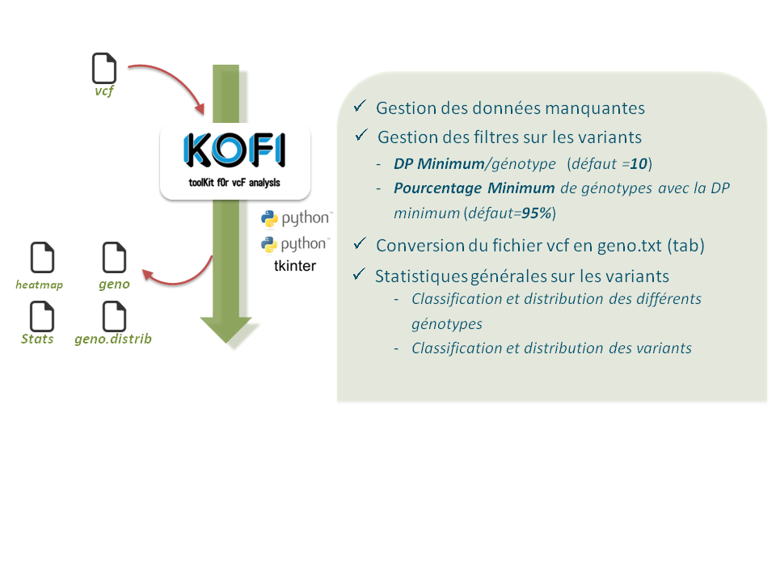
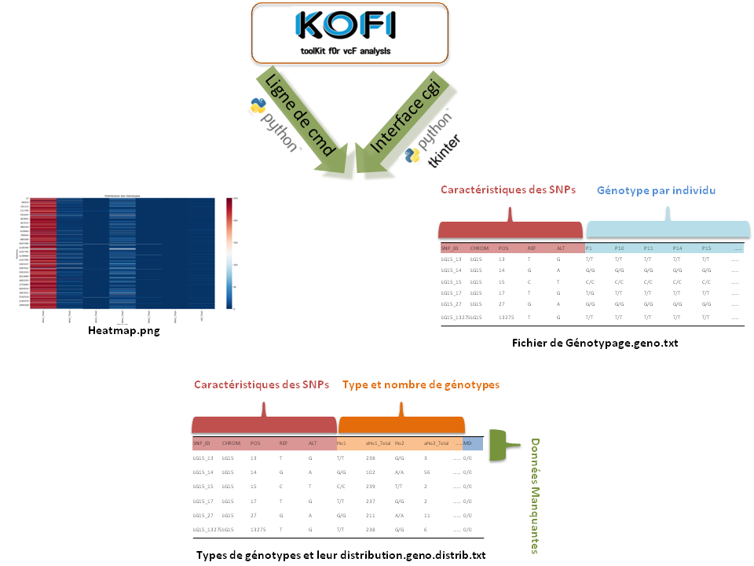

# KOFI : toolKit fOr vcF analysIs

==========================

## Description

KOFI est un outil écrit en Python d'analyse et de visualisation de données VCF. Son objectif principal est de filtrer les données de génotypage d'un fichier vcf pour en extraire les informations utiles à son analyse. 

=============================
Pour réaliser les analyses l'utilisateur pourra choisir entre :  
- Une version en ligne de commande via un terminal.
- Une interface cgi. 

KOFI propose à l'utilisateur de fixer:
- Les données manquantes tolérées (la valeur par défaut est fixée à 5%)
- La profondeur minimale de "reads" (DP) par individu génotypé (la valeur par défaut est fixée à 10X)
- Le pourcentage minimum de génotype avec la DP minimale (la valeur par défaut est fixée à 95%)

## Les sorties KOFI

Au terme de l'analyse et en fonction des options choisies par l'utilisateur KOFI génère plusieurs types de sorties:
- Un nouveau fichier vcf résultat des filtres effectués par l'utilisateur.
- Un fichier texte tabulé de génotypage (geno.txt) où sont affichés les variants détectés, leur position, le chromosome/Groupe de liaison et les génotypes de chaque individu. Dans ce ficher le codage numérique des génotypes est converti en nucléotides par exemple 1/0 au niveau du vcf pourra correspondre à A/T dans le fichier geno.txt
- Un fichier texte tabulé (distrib.geno.txt). Dans ce fichier les différents type de génotypes sont répertoriés et comptabilisés pour chaque variant. 
- Une représentation graphique sous forme de heatmap (.png) est générée. Elle traduit la densité des différents types de génotypes répertoriés pour chaque position.
- Une représentation graphique sous forme de heatmap (.png)/ Un fichier texte tabulé (stat.geno.txt) est généré. Ce fichier répertorie et comptabilise les différents types de mutation (substitutions/ insertions/ délétions)  

Les différents types de génotypes sont définis en fonction des allèles détectés au niveau du vcf ainsi les associations:
- 0/0; 1/1; 2/2 vont correspondre respectivement à Ho1, Ho2, Ho3
- 0/1; 0/2; 1/2 vont correspondre respectivement à He1, He2, He3
Il est à noter que KOFI traite les données phasées dans le vcf mais ne tient pas compte -pour des raisons de complexité- de l'ordre des allèles lors des différentes étapes de conversion.

===========================

## Installation & Utilisation
Pour installer et utiliser KOFI suivez ce lien:

*[Manuel d'intallation](https://github.com/emiracherif/VCF-project/blob/master/INSTALL.md)

## Contributing

* Licencied under CeCill-C (http://www.cecill.info/licences/Licence_CeCILL-C_V1-en.html) and GPLv3 
* Intellectual property belongs to Magali Arhainx and  Emira Cherif 
* Written by Magali Arhainx and  Emira Cherif
* Copyright 2014-5000

## Contact 

For bug tracking purpose you can use the GitHub questions or you can contact the developers at
magali.arhainx@etu.umontpellier.fr and emira.cherif@etu.umontpellier.fr
