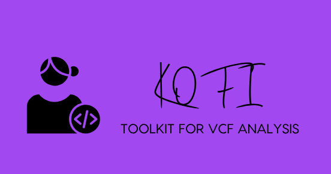

# KOFI : toolKit fOr vcF analysIs


==========================

KOFI est un logiciel d'analyse et de visualisation de données VCF. Son objectif principal est de filtrer un fichier vcf pour en extraire les informations utiles à son analyse. 


Il se décline en deux versions différentes :


## Pré-requis

python3

Les dernières versions des packages suivants doit être installées sur votre machine:
os, sys, pathlib, argparse, re, numpy, pandas, seaborn, matplotlib.pyplot


```
pip install --upgrade *package name*
```


## Installation

*[Installation manual](https://github.com/emiracherif/VCF-project/blob/master/INSTALL.md)

## Utilisation

Command

Arguments

Si le vcf de départ est phasé le fichier geno respectera l'ordre du phasage meme si le genotype est noté "/"


## Améliorations

##Contributing

* Licencied under CeCill-C (http://www.cecill.info/licences/Licence_CeCILL-C_V1-en.html) and GPLv3 
* Intellectual property belongs to ... 
* Written by Magali Arhainx and  Emira Cherif
* Copyright 2014-5000

## Contact 

For bug tracking purpose you can use the GitHub questions or you can contact the developers at
xxx@xxx.fr](mailto:xxx@xxx.fr)

.
.
.

