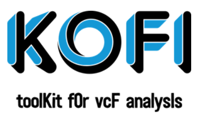

# KOFI : toolKit fOr vcF analysIs

==========================

## Déscription

KOFI est un logiciel d'analyse et de visualisation de données VCF. Son objectif principal est de filtrer les données de génotypage d'un fichier vcf pour en extraire les informations utiles à son analyse. 

=============================
Pour réalliser les analyses l'utilisateur aura le choix de le faire soit avec:  
- Une version en ligne de commande via un terminal.
- Une interface cgi 

KOFI propose à l'utilisateur de fixer:
- les données manquantes tolérées (la valeur par défaut est fixée à 5%)
- la profondeur minimale de "reads" (DP) par individu génotypé (la valeur par défaut est fixée à 10X)
- le poucentage minimimum de génotype avec la DP minimale (la valeur par défaut est fixée à 95%)

## Les sorties KOFI

===========================

## Installation

*[Manuel d'intallation](https://github.com/emiracherif/VCF-project/blob/master/INSTALL.md)

## Contributing

* Licencied under CeCill-C (http://www.cecill.info/licences/Licence_CeCILL-C_V1-en.html) and GPLv3 
* Intellectual property belongs to Magali Arhainx and  Emira Cherif 
* Written by Magali Arhainx and  Emira Cherif
* Copyright 2014-5000

## Contact 

For bug tracking purpose you can use the GitHub questions or you can contact the developers at
magali.arhainx@etu.umontpellier.fr and emira.cherif@etu.umontpellier.fr

.
.
.

